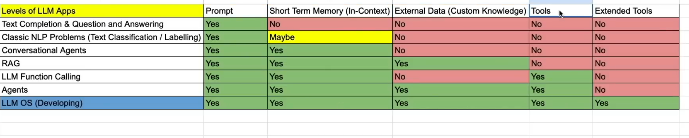

LLM
llama (two files) (parameters and run.c)

Neural network -> measure and reposnse what is the next word.
Linear -> Near straight line - constant 
Dalle - Images creation
LLM -> Its like Os for AI.
LLLAMA - Ex: Unix like open source

How the LLM trained and Created:
Stage 1:
    Pretraining (obtain base model) - More costly. - trains for a year 
Stage 2:
    Fine tuning -> every week - > label the data -> obtain assitant model -> cheaper ->  
Stage 3: 

    Optional -> Comparison labels -> Finetuning -> RLHF Reinforcement learning from human feedback.

which Model is good: 
>> chatbot arena leaderboard > 
compares the model and provide ratings
https://arena.ai/leaderboard/text

SAFETY ISSUE
>> Jail break - acting like a polished person and get info from the AI . 
 eX: encoded value will iddisplay the results.
    Image - backside content we an inject the details to AI.

Prompt injection attack
>> send blank image and ask what do this say - AI will check and repsond something.
>> hacker links in the AI repsonse.
>> Modiy the url with data exfiltration text and create like a query and pass to the AI. that will give the get resquest related information 

Backdoor attack / Data poisoning
>> sleeper agent attack - > silently destroying the AI by giving false information

Tiktokenizer - split the input and generate a token for every word and use can validate that in their website.
https://tiktokenizer.vercel.app/ => gives the token used for AI input 
Context window - is a time period fo the chat. continous coverstation.

=====================
Generative AI
Named entity Recognition -> based on the text automatically recognise the detials.
runpod - rents GPU

LLM -> NVDIA GPU -> CUDA software 
-> 1. Data sets (Large amount of data set is required)
-> 2. Train a model (Build a model)  Fine tuning
-> 3. Benchmark/ Evaluvate the model

Tansfer Learning

Running the model is called inferntial/Infernce.

Quantization -> reduce the size and response
Quantised models -> reduced size  ex: llama.cpp, gguf, ggml

CPU / GPU (NVDIA/AMD) /TPU (Google) / Metal (Apple software) M1,M2,M3

Pytorch (C++)
Jax
mlx (apple solution)

LLM Inference - > Running API and get reponse in text output.
LLM API -> OPENAI

properietary model - cost involved.
open models. -> modelweight (.bin file/safetensor file) -> selfhost

5 levels of LLAPPs
LLM OS
AGENTS
RAG -> Real time data -> External memory -> Long chats -> (3D)
Chatbot -> convesation chat -> (short term memory) -> (2D)
Q&A engine -> prompt - LLM - Answer (1D)

prompt - captial of tamilnadu.
short term memory -> short chats (chatbot)
external memory -> Long chats (who is the CEO of apple/manage of team handling iphone 16) (custom knowlege)
tools -> Calculator
extended tools -> extra calculations

Ritual agumented generation -> prompt+ Query+ relavant data
classificaiton NLP problems- Text classification/labelling 

LLM function calling -> Currency converter
    what is USD to INR today?? -> differnet format will be captured and responded.

Agent - Function + tools
rules + Goal -> Agents

============
Prompt engineering.
Top K - top results
Top P - within probability ranges
temperature

Zero prompting = General chat 
Few shot - 
System promprting  - you are hte program tutor and asking question  (Exaclty this person)
contextual prompting - Based on the reason (context) and start chat
Role promptying -> Act like this person (Acting like this person)

Chain of thoughts -> for reasoning purpose
temprature = 0 - Temperature reshapes these probabilities:
- Low temperature (0–0.3)
- Picks the most likely next word
- Output is consistent, factual, repetitive
- Good for coding, math, instructions
- Medium temperature (0.5–0.7)
- Balanced creativity and accuracy
- Good for general conversation
- High temperature (0.8–1.2+)
- More randomness
- Output is creative, surprising, sometimes less coherent
- Good for brainstorming, storytelling

self consistency - (question will be splitted with different answer) value is set 
Tree of thought - (question will be splitted with different answer) value is not set

API key for Ollama

ReAct - Repeat and action Feature calling.
ToT-Tree of Thought
self consistency - 
chain of thought - step by step prompts
System prompting 
Role prompting
contextual prompting - 

