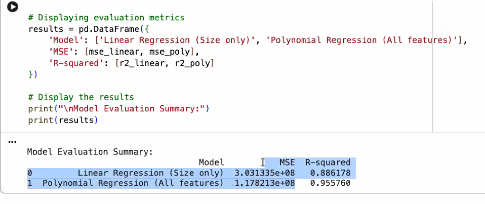

https://colab.research.google.com/drive/1Mr9bmeU4kEF5hsed0bkm6QTa99jMquuz#scrollTo=J0sEHTnb05RF

https://colab.research.google.com/drive/1jgbZdnYZLlFyXk03lT7HChIgs2f--VYi?usp=sharing#scrollTo=OFJvqRrRsvtA

Linear regression
 > y= mx+c

Polynomial regression equestion. 
 > predict the next value using this.

 Linear vs polynomial
 > house age prediction
 > 

 Simple linear regression
  y = price
  mean squared error > model error calculation > number of mistakes
  
  R squred > good cases> fitness of response calculation

https://colab.research.google.com/drive/1ZblD_7RN96x8DvzhL1yIXxo_DLcuanNA?usp=sharing

gradient desent applicaiton
> 

Regression problems.

c=constant 

supervised - Labelled one
unsupervised - unlabelled 
Nueral network - 

y=W1+x1

https://www.youtube.com/@NithyaDuraisamy

https://tamilarasan.io/talks-toronto.html