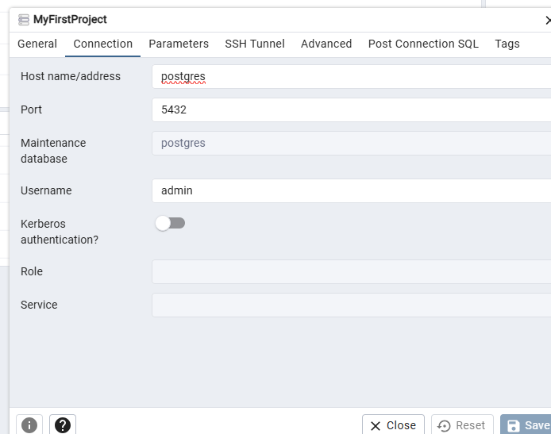

# PythonLearn
My github repo.
https://github.com/jeraku/PythonLearn/tree/myfirstproject

Plan:
packaging: Venv
DB: Postgres DB
<!-- Frontend: Django flask -->
backed API: Fast API
<!-- cache mechanism: redis cache
pydantic model -->

Step1 : 
check for test.py worked properly once the initial setup is completed.

Step 2: 
Venv setpup for packaging
go to the project path. 

>> python -m venv venv
>> ./venv/Scripts/activate   --------- command for activation

To confirm venv step up is fine.
>> pip install pandas
>> pip freeze > requirements.txt

>> pip install -r requirement.txt ------ for installing from the requirements.txt file
>> deactivate ----------- command for deactivation
Note: I tried in command shell and worked.

Step 3: DB information (Plan via docker steup)
data store from DB - How to achieve step by step.
>> docker ps
precondition: Create docker-compose.yaml file and docker volumes to be created
>> docker-compose up -d
>> http://localhost:8081/login
Login with jegan@admin.com and admin and register with the below connection

Step 4: 
>> pip install fastapi uvicorn pydantic psycopg2-binary redis

