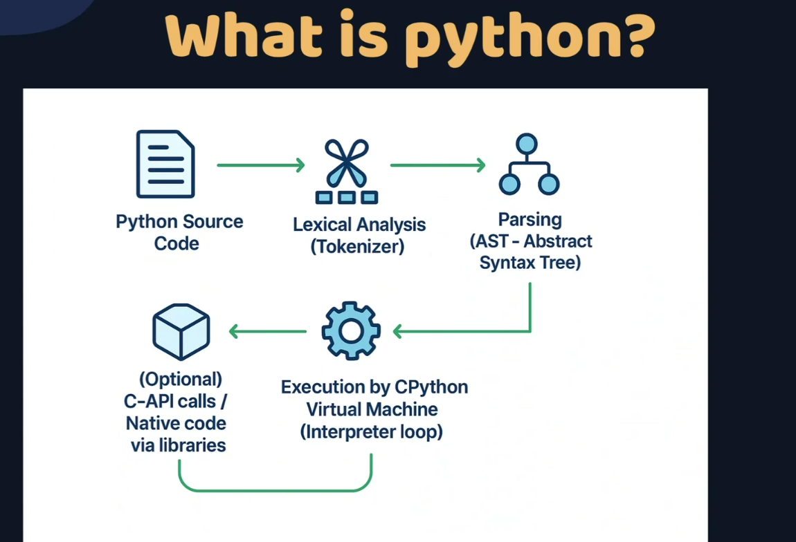
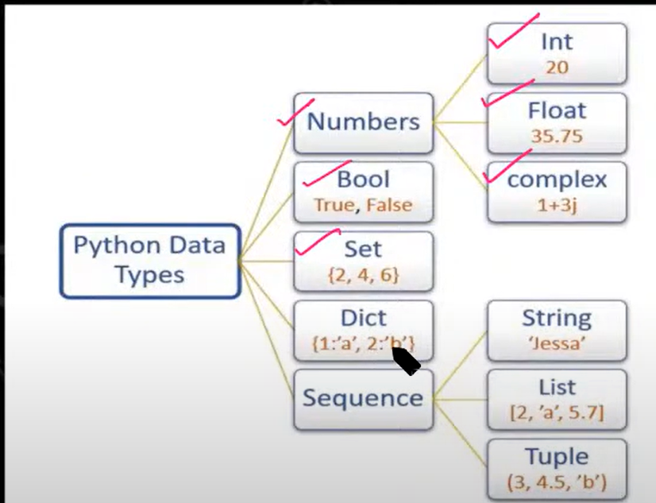

list -> ordered and mutable and allow duplicates, follow index numbers
set -> unordered and mutable and does not allow duplicates, does not follow index order
tuple -> ordered and immutable and allow duplicates., follow index numbers
dict -> ordered(from python 3.7) and mutable  and Keys must be unique

